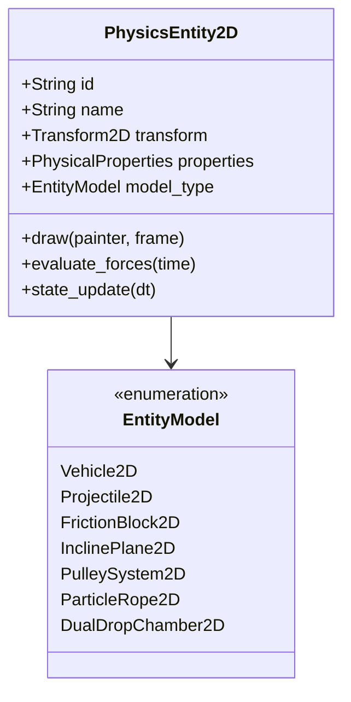
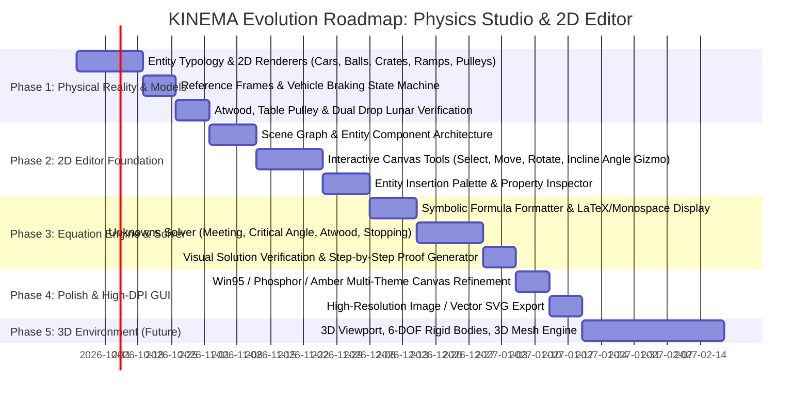

# KINEMA: Architecture & Strategic Roadmap
## From 1D Kinematic Viewer to Interactive 2D Physics Studio ("Blender for Physics")

**Version:** 2.0.0-DRAFT  
**Author:** KINEMA Core Architecture Team  
**Status:** Approved for Architectural Realignment  

---

## 1. Executive Summary & Problem Diagnosis

During testing of the KINEMA M6 Native Desktop GUI, 10 critical physical and visual failure modes were identified. These issues all stem from a single architectural limitation: **the entire simulation engine and renderer originally treated every physical entity as a scalar 1D value ($x(t)$) projected onto a single horizontal line, rendered as an identical cartoon cart with two wheels.**

```
[Previous Flawed Architecture]
Scalar 1D Motion (x(t)) ---> Generic 1D Vector ---> Universal Wheeled Cart on Horizontal Floor
(A ball falling 20m, a 50kg wooden crate, an Atwood pulley, and a 30° incline ramp were all 
drawn as horizontal rolling cars!)
```

### 1.1 Detailed Root-Cause Analysis of the 10 Observed Failure Modes

| # | Scenario Observed | User Finding | Root Cause in Codebase | Required Physical Reality |
|---|---|---|---|---|
| **1** | `two_cars_mruv` | *Yellow car reverses direction after meeting.* | $x_B(t) = x_0 + v_0 t + \frac{1}{2} a t^2$ evaluated purely as unbounded quadratic equation. With $v_0 = -10, a = +2$, velocity hits 0 at $t=5\text{s}$ and becomes positive. Real brakes apply friction force only while $v \ne 0$; once $v=0$, static friction stops the vehicle ($a=0$). Cars don't reverse unless in reverse gear with active motor propulsion. | State machine for vehicles: `Cruising`, `Braking` (stops at $v=0$), `Accelerating`, `Collided`. Meeting detection must trigger collision/halt or explicit educational turnaround explanation. |
| **2** | `coinciding_cars` | *No second car visible.* | Both cars share $x_0 = 25\text{ m}, v = 10\text{ m/s}$. Both are painted at exact same pixel $(px, py)$ with zero $y$-offset. Car B completely eclipses Car A. | Multi-lane road system (Lane 1, Lane 2) or elevation tracks with spatial separation and overlap handling. |
| **3** | `20m_free_fall` | *Car rolling horizontally instead of falling vertically.* | Coordinate system is hardcoded to horizontal $X$. Renderer draws a wheeled cart along the ground. Free fall along vertical $Y$ axis ($y(t) = y_0 - \frac{1}{2}gt^2$) was mapped to $x(t)$. | Vertical Cartesian frame ($Y$-axis up), drop tower/release clamp, spherical mass / physics ball, impact particle splash at ground level ($y=0$). |
| **4** | `feather_and_hammer_moon` | *Car on a horizontal plane instead of Moon vacuum drop.* | Rendered identically to a car race. No lunar surface, no vertical reference frame, no distinct geometries. | Dual vertical drop chamber/lunar setting ($g = 1.62\text{ m/s}^2$), distinct 2D meshes: geological hammer (steel head + wooden grip) vs falcon feather (quill + vanes) falling synchronously. |
| **5** | `vertical_projectile` | *Car rolling horizontally instead of vertical projectile.* | Vertical launch ($v_0 = 20\text{ m/s}$ straight up, $a = -g$) mapped to horizontal $X$ axis. Drawn as a wheeled car. | Vertical projectile launcher / cannon, ascending ball/shell, velocity vector arrow flipping at apex ($v=0, h_{max}$), descent and ground impact. |
| **6** | `block_friction_threshold` | *Unclear behavior; drawn as car; no friction meaning.* | Drawn as a rolling car. No contact patch, no applied force arrow $\vec{F}_{ext}$, no opposing friction arrow $\vec{f}_r$, no threshold indicator. | Rectangular block on textured surface. Visual vector overlay: $\vec{N}$, $\vec{W}=m\vec{g}$, $\vec{F}_{ext}$, $\vec{f}_r$. Clear static threshold breakdown: $f_{s,max} = \mu_s N$. If $F < f_{s,max}$, block stays immobile ($a=0$). If $F > f_{s,max}$, block slides with $f_k = \mu_k N$. |
| **7** | `incline_plane_slide` | *Drawn on flat horizontal ground; violates physics reference frame.* | No incline wedge drawn. Block sliding on a 30° ramp was drawn on a flat horizontal floor. | Inclined wedge geometry with angle $\theta$. Rotated coordinate frame ($x_\parallel, y_\perp$). Gravity decomposed: $W_\parallel = mg\sin\theta, W_\perp = mg\cos\theta$. Normal force $\vec{N}$ perpendicular to incline. |
| **8** | `heavy_crate_push` | *No crate visible; blue cart with wheels shown.* | "Crate" body was assigned default vehicle rendering (blue rect with wheels). | Heavy industrial wooden crate geometry (planks, diagonal bracing, wood grain), sliding friction contact patch, push force vector from hands/piston. |
| **9** | `atwood_machine` & `table_pulley` | *No pulley, table, or hanging masses visible.* | 2D multi-body topologies were flattened to a single scalar acceleration value and drawn as a lone horizontal cart. | **Atwood:** Ceiling mount, grooved pulley wheel, cord looping over pulley, mass $m_1$ rising, mass $m_2$ descending.<br>**Table:** Horizontal table bench, block $m_1$ sliding on surface, corner pulley at edge, vertical cord to hanging mass $m_2$. |
| **10** | `hanging_catenary_rope` & `rope_surface_friction` | *Rope floating in middle of canvas; frozen ends; weird friction.* | Rope Verlet nodes rendered in canvas dead center with arbitrary scale, no anchor hooks/posts, no ground/table collision geometry. | Rigid anchor posts/ceiling hooks, realistic catenary sag equations, physical contact with ground floor or table edge with friction. |

---

## 2. Core Paradigm Shift: From Viewer to "Blender for Physics"

The long-term mission of KINEMA is to be the **standard open-source 2D Interactive Physics Studio & Problem Solver**, evolving progressively:

```
[PHASE 1: Physical Reality & Entity Typology]
Accurate 2D Physics Systems, Rotated Reference Frames, Specific Visual Models & Behaviors
                         │
                         ▼
[PHASE 2: Interactive 2D Editor ("Blender for Physics")]
Scene Graph, Drag-and-Drop Tools, Gizmos, Entity Spawner, Parameter Inspector, Undo/Redo
                         │
                         ▼
[PHASE 3: Symbolic & Numerical Equation Engine]
Dynamic Formula Derivation, Unknowns Solver ("Incógnitas"), Step-by-Step Educational Proofs
                         │
                         ▼
[PHASE 4: Visual Polish, Aesthetics & Export Studio]
Win95/Phosphor/Amber High-DPI themes, Camera Tracking, Video & Vector SVG/PNG Export
                         │
                         ▼
[PHASE 5: 3D Physics Environment (Future Milestone)]
3D Viewport, 6-DOF Rigid Bodies, 3D Mesh Importers, Spatial Force Fields
```

---

## 3. Entity & Geometry Architecture: The 2D Scene Graph

Every object in a KINEMA scene is no longer a generic `Body` with a scalar `Motion1D`. Instead, it is a typed **`PhysicsEntity2D`** possessing:
1. **Reference Frame & Transform:** Position $\vec{r} = (x, y)$, rotation $\theta$, coordinate frame type (Horizontal, Vertical, Incline Wedge, Suspended Cable).
2. **Physical Model & Properties:** Mass, dimensions, friction coefficients, aerodynamic drag coefficient, internal state machines (e.g. vehicle engine/braking states).
3. **Dedicated Visual Renderer:** Custom procedural 2D geometry (not placeholder sprites) matching its physical nature.
4. **Forces & Interaction Ports:** Active forces ($\vec{W}, \vec{N}, \vec{f}_r, \vec{F}_{ext}, \vec{T}$), constraints (attached to cord, resting on surface, pinned).



### 3.1 Specification of Entity Models

#### 1. Vehicle2D (Cars, Carts, Trucks)
- **Visuals:** Aerodynamic chassis, dual styled wheels with rims, driver silhouette/windshield, headlights, lane assignment ($y$-lane offset).
- **Physics:** Forward propulsion $F_{engine}$, rolling resistance $f_{rr}$, aerodynamic drag $F_d = \frac{1}{2}\rho C_d A v^2$, braking force $F_{brake}$.
- **State Logic:** When brakes are applied, deceleration continues strictly until $v = 0$. At $v = 0$, velocity locks at zero unless reverse gear is explicitly engaged.

#### 2. Projectile2D (Spheres, Cannonballs, Stones, Rockets)
- **Visuals:** Dense metal/rubber ball with center-of-mass crosshair, launch trajectory trail with historical ghost particles, vector arrows for $\vec{v}$ and $\vec{a}$.
- **Physics:** 2D ballistic kinematics $\vec{r}(t) = \vec{r}_0 + \vec{v}_0 t + \frac{1}{2}\vec{g}t^2$, optional quadratic air resistance $\vec{F}_d = -c |\vec{v}|\vec{v}$.
- **Events:** Apex detection ($\dot{y} = 0$, maximum altitude reached), ground impact ($y \le 0$) with elastic/inelastic restitution or halt.

#### 3. DualDropChamber2D (Galileo Moon / Vacuum vs Air Experiment)
- **Visuals:** Two parallel vertical drop chutes or an open lunar surface with Earth in the sky. Left chute: Falcon Feather (delicate quill, vanes, flutter simulation). Right chute: Apollo Geological Hammer (textured steel head, grooved handle).
- **Physics:** Gravity selectable (Moon $g=1.62$, Earth $g=9.81$, Vacuum chamber $g=9.81, \rho=0$). Shows both hitting the regolith at the exact same frame in vacuum, and feather floating with terminal velocity in air.

#### 4. FrictionBlock2D (Crates & Friction Blocks)
- **Visuals:** Textured wooden crate (cross bracing, nails) or solid metallic block. Contact surface shows microscopic teeth/roughness icon.
- **Vectors Overlay:** Directly drawn from the center of mass and contact patch:
  - $\vec{N}$ (Normal force pointing straight up).
  - $\vec{W} = m\vec{g}$ (Weight pointing straight down).
  - $\vec{F}_{ext}$ (Applied force arrow from pusher).
  - $\vec{f}_r$ (Friction opposing motion).
- **Threshold Gauge:** A real-time dial or bar showing $F_{ext}$ vs $f_{s,max} = \mu_s N$. When $F_{ext} < f_{s,max}$, the status reads **"STATIC EQUILIBRIUM ($a=0$)"**. Once $F_{ext} > f_{s,max}$, status switches to **"KINETIC SLIDING ($f_k = \mu_k N$)"**.

#### 5. InclinePlane2D (Wedges & Inclined Ramps)
- **Visuals:** Solid triangular wedge with base, height, and angle $\theta$ with arc degree readout. Textured inclined slope.
- **Reference Frame:** Tilted coordinate frame $(x_\parallel, y_\perp)$ with visual grid aligned to the incline.
- **Physics:** Decomposition of weight:
  $$W_\parallel = m g \sin\theta, \quad W_\perp = m g \cos\theta$$
  $$N = m g \cos\theta, \quad f_{s,max} = \mu_s m g \cos\theta$$
  Critical angle indicator: $\theta_c = \arctan(\mu_s)$. If $\theta > \theta_c$, sliding is automatic.

#### 6. PulleySystem2D (Atwood & Table Systems)
- **Visuals:**
  - **Atwood:** Rigid ceiling bracket, rotating circular pulley wheel with axle, cord wrapped over grooves, suspended masses $m_1$ and $m_2$ with mass labels and vertical height rulers.
  - **Table Pulley:** Solid laboratory table bench, horizontal mass $m_1$ on tabletop, low-friction pulley wheel bolted to table corner, string extending to hanging mass $m_2$.
- **Physics:** Coupled Newton-Euler equations:
  $$a = \frac{m_2 - m_1}{m_1 + m_2} g \quad (\text{Atwood}), \quad a = \frac{m_2 - \mu_k m_1}{m_1 + m_2} g \quad (\text{Table})$$
  $$T = \frac{2 m_1 m_2}{m_1 + m_2} g$$

#### 7. ParticleRope2D (Verlet Catenary & Cable Ropes)
- **Visuals:** Industrial anchor brackets/bolts at pinned nodes. Rope segments drawn with thickness and tension-based thermal coloring (Blue = slack, Green = nominal, Red = high tension).
- **Physics:** Position-based Verlet integration with distance constraint relaxation, rigid floor collision, and optional surface friction.

---

## 4. The 2D Editor Architecture ("Blender for Physics")

```
┌─────────────────────────────────────────────────────────────────────────────┐
│ KINEMA 2D Physics Studio - [Untitled Scene 1 *]                             │
├─────────────────────────────────────────────────────────────────────────────┤
│ File   Edit   View   Scene   Insert   Simulate   Solver   Help              │
├─────────────────────────────────────────────────────────────────────────────┤
│ [Select] [Pan] [Move] [Rotate] [Ruler] │ [Car] [Ball] [Block] [Ramp] [Pulley]│
├──────────────────────────┬─────────────────────────────┬────────────────────┤
│ TOOLBOX & HIERARCHY      │ INTERACTIVE 2D CANVAS       │ PROPERTY INSPECTOR │
│                          │                             │                    │
│ Scene Graph:             │   ▲ y                       │ Selected: Crate_1  │
│  ├─ World (g = 9.81)     │   │     F_ext               │ Mass: [ 50.0 ] kg  │
│  ├─ Ground (μs=0.4)      │   │   ┌───────►             │ Pos X: [ 10.0 ] m  │
│  ├─ Crate_1              │   │   │ Crate 1 │           │ Pos Y: [  0.0 ] m  │
│  │   └─ FBD Overlay      │───┼───┴─────────┴─────────► │ μ_s:  [ 0.40 ]     │
│  └─ InclinedRamp_1       │ 0 │        x                │ μ_k:  [ 0.25 ]     │
│      └─ SliderBlock      │                             │ F_ext:[ 250.0] N   │
│                          │ Metric Track: 0m ... 50m    │ Angle:[  0.0 ] deg │
├──────────────────────────┴─────────────────────────────┴────────────────────┤
│ EQUATION & UNKNOWNS SOLVER ("INCÓGNITAS")                                   │
│ Governing Eq: F_net = F_ext - μ_k·m·g = 250 - 0.25·50·9.81 = 127.38 N       │
│ Acceleration: a = F_net / m = 2.548 m/s²                                    │
│ Unknowns: Find t when x = 50m ──► [ SOLVE ] ──► t = 6.26 s                  │
└─────────────────────────────────────────────────────────────────────────────┘
```

### 4.1 Core Editor Components
1. **Interactive Tool Palette:**
   - **Pointer / Selection Tool ($V$):** Click to select, marquee select, drag to reposition objects on canvas.
   - **Transform Gizmo ($G, R$):** Interactive handles for translation along axes and rotation (e.g. changing incline angle $\theta$ interactively by dragging the ramp tip).
   - **Measure / Ruler Tool ($M$):** Click and drag between any two points to measure Euclidean distance $\Delta x, \Delta y, d$ and angle.
   - **Origin Tool ($O$):** Click anywhere to place the $(0, 0)$ coordinate system origin, automatically recalibrating all problem equations.

2. **Entity Insertion Palette:**
   - One-click buttons to drop physical objects into the scene with standard realistic presets:
     - `+ Vehicle (Car / Truck)`
     - `+ Ball / Projectile`
     - `+ Dry Friction Crate / Block`
     - `+ Inclined Plane (Wedge)`
     - `+ Atwood Pulley`
     - `+ Table Pulley`
     - `+ Catenary Rope`

3. **Live Free-Body Diagram (FBD) Inspector & Overlay:**
   - Toggleable directly on the canvas: every entity renders its real-time force vectors with length proportional to magnitude (in Newtons) and labels ($N, W, f_r, T, F_{app}$).

---

## 5. Symbolic & Numerical Equation Engine ("Buscador de Incógnitas")

The true educational superpower of KINEMA is connecting **visual simulation with analytical physics homework and research problems**.

### 5.1 Dynamic Equation Generation
As objects, ramps, and pulleys are configured on canvas, the engine compiles their analytic equations:
- For kinematics: $x(t) = x_0 + v_0 t + \frac{1}{2}a t^2$, $v(t) = v_0 + a t$.
- For inclined planes: $a = g(\sin\theta - \mu_k \cos\theta)$.
- For Atwood systems: $a = \frac{m_2 - m_1}{m_1 + m_2} g, \quad T = \frac{2 m_1 m_2}{m_1 + m_2} g$.

### 5.2 Unknowns Solver ("Buscador de Incógnitas")
A dedicated solver interface where the user or student specifies what is known and what is sought:
- **Meeting Problems:** Given Car 1 ($x_{0,1}, v_{0,1}, a_1$) and Car 2 ($x_{0,2}, v_{0,2}, a_2$):
  - Solves $x_1(t) = x_2(t)$ analytically via quadratic formula.
  - Automatically identifies whether $t_{enc} \ge 0$ exists, calculates $x_{enc}$, and checks if stopping occurs before meeting.
- **Friction Threshold Problems:** Given $m, \mu_s$:
  - Solves for minimum $F_{push}$ to initiate motion.
  - Solves for critical incline angle $\theta_c = \arctan(\mu_s)$.
- **Reverse Verification:** The user can click **"Simulate to Solution"**, which seeks the simulation clock directly to the calculated instant and validates that the bodies visually coincide or achieve the computed state.

---

## 6. Phased Implementation Roadmap



### Phase 1: Physical Reality, Reference Frames & Dedicated Entity Models
*Goal: Fix all 10 simulation and visual inaccuracies identified by the user.*
1. **Reference Frame Engine:** Implement support for Horizontal $X$, Vertical $Y$, and Rotated Incline $(x_\parallel, y_\perp)$ coordinate spaces.
2. **Entity Typology:**
   - `Vehicle2D`: Realistic car body with wheels, headlights, multi-lane offsets, and physical brake logic (stops at $v=0$, zero reverse ghosting).
   - `Projectile2D` & `FreeFall2D`: Vertical falling spheres/stones with apex detection and ground impact.
   - `DualDropChamber2D`: Galileo Moon vacuum demonstration with distinct Apollo hammer and falcon feather.
   - `FrictionBlock2D`: Industrial wooden crate with live FBD force vectors ($\vec{N}, \vec{W}, \vec{F}_{ext}, \vec{f}_r$) and static threshold gauge.
   - `InclinePlane2D`: Real wedge with adjustable angle $\theta$, tilted coordinate system, and sliding block.
   - `PulleySystem2D`: Complete Atwood and Table-Pulley systems with pulleys, cables, and vertical hanging weights.
   - `ParticleRope2D`: Fixed anchor brackets, catenary curves, and physical surface contact.
3. **Preset Scenario Overhaul:** Re-author all 14 preset scenarios to use their native entity models and reference frames.

### Phase 2: Interactive 2D Physics Editor ("Blender for Physics")
*Goal: Transform KINEMA from a preset viewer into an authoring laboratory.*
1. **Scene Graph & Dynamic Entities:** Dynamic list of heterogeneous 2D entities with hierarchical parent-child transforms.
2. **Interactive Canvas Tools:**
   - Selection tool with click and drag bounding boxes.
   - Translation and rotation gizmos on canvas (e.g. interactively dragging ramp height or pulling a cart).
   - Coordinate origin placer ($X=0, Y=0$) and metric measuring tape.
3. **Entity Creation Palette:** Dropdown / toolbar to instantiate new vehicles, balls, crates, wedges, pulleys, and ropes.
4. **Property Inspector:** Full editing panel for mass, friction, velocity, forces, and angles with instant canvas preview and full Undo/Redo.

### Phase 3: Symbolic & Numerical Equation Engine ("Buscador de Incógnitas")
*Goal: Bridge visual physics with homework problems and analytical solving.*
1. **Dynamic Equation Formatter:** Automatically builds exact algebraic formulas for any active scene.
2. **Unknowns Solver ("Buscador de Incógnitas"):**
   - Interactive dialog: select target variable ($t_{meet}, x_{meet}, a, T, \mu_s, \theta_c, h_{max}$).
   - Step-by-step mathematical proof output with intermediate substitutions.
   - "Seek to Solution" button to verify visual alignment at the solved instant.

### Phase 4: Visual Polish, Themes & Export Studio
*Goal: Deliver publication-quality educational diagrams and retro aesthetics.*
1. **Win95 & Retro Themes:** Refine canvas shaders, beveled panel borders, CRT scanlines, and high-contrast amber/phosphor palettes.
2. **Diagram Export:** Export high-resolution PNG, vector SVG, and animated frame sequences with customizable force vector annotations for textbook inclusion.

### Phase 5: 3D Physics Environment (Future Milestone)
*Goal: Expand the proven 2D editor into a 3D simulation laboratory.*
1. 3D OpenGL / WGPU viewport with orbit, pan, and zoom controls.
2. 6-DOF rigid body dynamics (inertia tensors, quaternions).
3. 3D meshes for vehicles, terrain, ramps, and apparatus.

---

## 7. Quality Gates & Architectural Invariants

1. **Hexagonal Purity:** Domain logic (`kinema_domain`) and Application logic (`kinema_app`) MUST remain strictly 100% headless and decoupled from GUI dependencies.
2. **Cyclomatic Complexity:** Every single function across all crates must strictly satisfy $CC \le 5$.
3. **No Placeholders or Generic Falsehoods:** No vehicle shall ever be used as a stand-in for a projectile, crate, or pulley. Every physical entity must have its proper physical model, reference frame, and dedicated visual geometry.
4. **Physical Invariants:**
   - Brakes cannot cause spontaneous reverse acceleration.
   - Free fall must occur along the vertical gravitational vector.
   - Inclined planes must account for incline angle in geometry, normal force, and weight components.
   - Pulleys must display both connected masses and cord routing.
